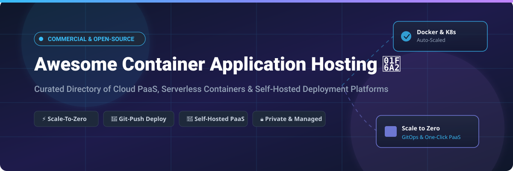

# Awesome-Container-Application-Hosting 🚢 ☁️

  

  
  
  
  
  
  

---

## 🌟 Top Container Application Hosting Ecosystem

**Curated List of Commercial PaaS Platforms & Open-Source Self-Hosted Application Hosting Tools**  
*Focused on Git-Push Deploys, Serverless Containers, Scale-to-Zero, Preview Environments, Managed Databases & Self-Hosted PaaS*

**Last updated: October 2026** 📅

---

### 📌 Overview & SEO Summary

Welcome to the ultimate curated directory of **container application hosting platforms**, **open-source PaaS alternatives**, and **self-hosted deployment tools**. Whether you are looking for enterprise-grade commercial solutions (such as *Google Cloud Run*, *Render*, and *Railway*), or self-hostable open-source alternatives (like *Coolify*, *Dokploy*, and *OpenRun*), this list covers category leaders, GitOps workflows, and privacy-respecting application deployment.

**Key Market Context:**
- **Coolify** has emerged as the **leading open-source PaaS** with **62,000+ GitHub_Stars**, offering **Heroku/Vercel/Netlify alternative** functionality on your own infrastructure 🚀.
- **OpenRun** is the **declarative GitOps alternative to Cloud Run and App Runner**, with **scale-to-zero** and **OAuth/SAML RBAC** built in 📝.
- **Homerun** provides a **single-user PaaS for homelab users**, with **live deploy progress**, **automatic SSL**, and **S3 backups** 🏠.

---

## 📑 Table of Contents

- [🏢 SaaS & Commercial Platforms](#-saas--commercial-platforms)
- [🔓 Open-Source GitHub Projects](#-open-source-github-projects)
- [🛠️ How to Contribute](#%EF%B8%8F-how-to-contribute)
- [📊 Star History](#-star-history)
- [🤝 Support & Sponsorship](#-support--sponsorship)
- [⚠️ Disclaimer](#%EF%B8%8F-disclaimer)

---

## 🏢 SaaS & Commercial Platforms

> 📈 **Market Size & Structure Analysis:**  
> The global Platform-as-a-Service (PaaS) and Container Application Hosting market is estimated at **$28.5 Billion in 2026** and projected to reach **$65.8 Billion by 2031** (growing at a CAGR of 18.2%). The sector is **moderately fragmented**: hyper-scaler cloud providers (*Microsoft Azure, Amazon AWS, Google Cloud*) dominate enterprise workloads with serverless containers, while specialized developer PaaS startups (*Render, Railway, Fly.io, Koyeb*) capture high-velocity developer and indie hacker mindshare with superior developer experience (DX).

| SaaS / Commercial Platform | Company / Owner | Valuation / Market Cap | Standard Edition Starting Price | Free Tier / Free Trial Limits | Description |
| :--- | :--- | :--- | :--- | :--- | :--- |
| **[Azure Container Apps](https://azure.microsoft.com/en-us/products/container-apps/)** 🔷 | Microsoft | ~$3.90 Trillion | **$0.000024/vCPU-sec** ($0 floor when idle) | **180,000 vCPU-seconds, 360,000 GB-seconds & 2M requests/mo free forever** | **Azure-native serverless containers** — Built on K8s, KEDA, Dapr, Envoy. Scale-to-zero microservices. |
| **[Google Cloud Run](https://cloud.google.com/run)** 🌐 | Google (Alphabet) | ~$2.00 Trillion | **$0.00002400/vCPU-sec** ($0 floor when idle) | **2M requests, 180,000 vCPU-sec & 360,000 GiB-sec/mo free forever** | **GCP-native serverless containers** — Scale-to-zero with $0 idle cost. Built on Knative for container portability. |
| **[AWS App Runner](https://aws.amazon.com/apprunner/)** ☁️ | Amazon | ~$2.00 Trillion | **$0.007/vCPU-hour + $0.0085/GB-hour** | **90-day free trial: 2,000 vCPU-hours & 4,000 GB-hours/mo** | **AWS-native container hosting** — Build from source or container image with automatic scaling and load balancing. |
| **[Heroku](https://www.heroku.com/)** 🟣 | Salesforce | ~$250.00 Billion | **$7.00/month** (Eco / Basic Dyno) | **No free tier** (30-day free trial with $13 credit for verified accounts) | **The original PaaS** — Buildpacks, add-on marketplace, managed Heroku Postgres. Mature ecosystem. |
| **[DigitalOcean App Platform](https://www.digitalocean.com/products/app-platform)** 🌊 | DigitalOcean | ~$3.00 Billion | **$5.00/month** (Basic App tier) | **3 static sites free forever** (up to 1GB bandwidth/mo) | **Simple PaaS** — Git-push deploys, managed databases, global CDN, and automatic SSL certificates. |
| **[Render](https://render.com/)** 🚀 | Render | ~$450 Million (Private) | **$7.00/month** (Starter Instance) | **Static sites free forever** + **750 free web service hours/mo** (spins down after 15m idle) | **Developer-friendly PaaS** — Git-push deploys, managed PostgreSQL/Redis, automatic SSL, preview environments per PR. |
| **[Fly.io](https://fly.io/)** ✈️ | Fly.io | ~$200 Million (Private) | **$5.00/month** (Hobby plan) | **$5/mo free credit allowance** (covers up to 3 shared-cpu-1x 256MB VMs) | **Edge application hosting** — Runs micro-VM containers close to users globally on custom hardware infrastructure. |
| **[Railway](https://railway.app/)** 🚂 | Railway | ~$100 Million (Private) | **$5.00/month** (Hobby base fee + usage) | **$5 one-time free credit** on trial account (500 execution hours limit) | **Modern application hosting** — Instant deploys from Git, managed databases, cron jobs, interactive template marketplace. |
| **[Porter](https://porter.run/)** 🚪 | Porter | ~$35 Million (Private) | **$200.00/month** (Standard BYOC cluster) | **14-day free trial** (up to 2 connected K8s clusters) | **Kubernetes-native PaaS** — Deploys directly into your own cloud account (AWS, GCP, Azure) with GitOps workflows. |
| **[Koyeb](https://www.koyeb.com/)** ⚡ | Koyeb | ~$15 Million (Private) | **$5.40/month** (Nano instance) | **1 free Nano service forever** (512MB RAM, 0.1 vCPU, 550 hours/mo) | **Global application hosting** — Serverless edge deployments, high-performance GPUs, multi-region routing. |

---

## 🔓 Open-Source GitHub Projects

*Sorted by GitHub_Stars_Count (Descending)* 🌟

- **[Coolify](https://github.com/coollabsio/coolify)**   
  **The leading open-source PaaS alternative to Vercel, Heroku, and Netlify**, Apache-2.0 licensed. **62,000+ GitHub_Stars** — **the most popular self-hosted PaaS** 🚀. **Deploy apps, databases, and 280+ one-click services** (Plausible, Gitea, Minio, n8n, and more) . **Git-push deploys** with GitHub, GitLab, Bitbucket, or Gitea — plus **preview deployments per PR**. **Nixpacks auto-detection** builds your stack without config. **Automatic SSL** via Let's Encrypt. **S3-compatible backups**. **Docker Swarm support** for multi-server. **Real-time terminal** in the browser. **Self-hosted version completely free** — no server limits, no feature restrictions. **Cloud dashboard from $5/month** (2 servers) . **The most complete open-source application hosting platform** .

- **[Dokploy](https://github.com/Dokploy/dokploy)**   
  **Open-source alternative to Vercel, Netlify, and Heroku**, source-available licensed. **37,381 GitHub_Stars** 🎯. **Runs on Docker with Traefik** for routing and SSL. **Native GitHub, GitLab, Bitbucket, and Gitea integrations**. **Heroku Buildpacks, Nixpacks, and Paketo** support. **Built-in metrics**, **AI-powered Docker Compose templates**, and **Docker Swarm support**. **Self-hosted free**; managed from **$4.50/month** . **The most efficient single-server PaaS** .

- **[Dokku](https://github.com/dokku/dokku)**   
  **Docker-powered PaaS for building and managing app lifecycles**, MIT licensed. **32,147 GitHub_Stars** 🐳. **"Heroku on a VPS"** — **Git-push deploys**, **buildpacks**, and **plugin system**. **No UI** — CLI-only. **The simplest minimal PaaS** .

- **[CapRover](https://github.com/caprover/caprover)**   
  **Scalable PaaS (automated Docker + nginx)**, Apache-2.0 licensed. **15,168 GitHub_Stars** ⚓. **"Heroku on Steroids"** — **one-click apps**, **Git-push deploys**, and **Nginx reverse proxy**. **The original open-source PaaS** — battle-tested for years.

- **[Kamal](https://github.com/basecamp/kamal)**   
  **Deploy web apps anywhere**, MIT licensed. **14,585 GitHub_Stars** 🚂. **From Basecamp** — **zero-downtime deploys**, **rolling restarts**, and **multi-server support**. **The simplest way to deploy containers to bare metal** .

- **[Komodo](https://github.com/moghtech/komodo)**   
  **Tool to build and deploy software on many servers**, open-source. **12,344 GitHub_Stars** 🦎. **Multi-server deployments** with **build and deploy workflows**. **The most scalable open-source deployment tool** .

- **[Piku](https://github.com/piku/piku)**   
  **The tiniest PaaS you've ever seen**, MIT licensed. **6,605 GitHub_Stars** 🐜. **Git-push deployments to your own servers**. **~1000 lines of Python**. **The most minimal open-source PaaS** .

- **[Kubero](https://github.com/kubero-dev/kubero)**   
  **Free and self-hosted PaaS alternative to Heroku/Netlify/Vercel**, Apache-2.0 licensed. **4,422 GitHub_Stars** ☸️. **Runs on Kubernetes** — deploys apps to your K8s cluster. **Git-push deploys** with preview environments. **The Kubernetes-native open-source PaaS** .

- **[SwiftWave](https://github.com/swiftwave-org/swiftwave)**   
  **Self-hosted lightweight PaaS for any VPS**, Apache-2.0 licensed. **890 GitHub_Stars** 🌊. **Install on bare metal, Raspberry Pi, Hetzner, DigitalOcean**. **Docker Swarm mode** for scaling. **The most lightweight open-source PaaS** .

- **[OpenRun](https://github.com/openrundev/openrun)**   
  **Declarative GitOps web app deployment**, Apache-2.0 licensed. **850 GitHub_Stars** 📝. **Open-source alternative to Google Cloud Run and AWS App Runner** . **Declarative config in Starlark** (Python-like) — **no YAML hell**. **Scale-to-zero** for idle apps. **OAuth/OIDC/SAML with RBAC**. **Atomic updates** across multiple apps. **Single binary, Docker/Podman dependency only**. **The most declarative open-source PaaS** .

- **[Frost](https://github.com/elitan/frost)**   
  **Open-source alternative to Vercel, Netlify, Railway, Render, and Neon**, open-source. **620 GitHub_Stars** ❄️. **Build, deploy, and run from one platform**. **Git push deploy workflow**. **Docker-native, no Kubernetes**. **S3-compatible object storage**. **REST API and MCP support for AI agents**. **The most comprehensive open-source deployment platform** .

- **[Homerun](https://github.com/orochibraru/homerun)**   
  **Self-hosted, single-user PaaS for homelab users**, open-source. **450 GitHub_Stars** 🏠. **Click-config form** for deploying Docker containers. **Point at an image or git repo, fill in env vars/port/resources, hit deploy** — Traefik routes it with TLS . **Live deploy progress** streamed to UI. **Deployment history** with full logs. **Templates for Redis, Postgres, MySQL, MongoDB, Adminer, Uptime Kuma, n8n, Vaultwarden**. **The most accessible open-source PaaS for homelabs** .

- **[Miabi](https://github.com/miabi-io/miabi)**   
  **Self-hosted PaaS with true workspace isolation and RBAC**, open-source. **310 GitHub_Stars** 🏢. **Multiple clusters & locations** — one control plane drives many clusters . **Pipelines (pipeline-as-code CI/CD)**, **build runners**, and **GitOps with declarative manifests**. **Marketplace** with WordPress, Ghost, Nextcloud, n8n, Gitea, and more. **Privacy-first analytics** — cookieless, no consent banner, IPs never stored. **Enterprise features**: SAML 2.0, SCIM, LDAP/AD. **The most enterprise-ready open-source PaaS** .

---

## 🛠️ How to Contribute

Contributions are welcome! Follow these steps to submit new container hosting platforms or open-source PaaS software:

1. 🍴 **Fork** the repository.
2. 📝 **Add/edit** entries in `README.md` maintaining table/list structure and formatting.
3. 🔗 Include project title, official website/GitHub link, exact Stars_Count, license, and brief description.
4. 🚀 Submit a **Pull Request** with a descriptive summary of your changes.

---

## 📊 Star History

---

## 🤝 Support & Sponsorship

If you find this container application hosting directory useful, thank you for checking it out! You can support ongoing maintenance and open-source curation through any of the following:

- ⭐ **Star** this repository on GitHub to increase visibility!
- 🔀 **Fork** and share with fellow developers, DevOps engineers, and open-source advocates.
- ☕ **Buy Me a Coffee / Sponsor**: Support ongoing open-source curation via the [GitHub Sponsor Dashboard](https://github.com/sponsors/ishandutta2007).

---

## ⚠️ Disclaimer

- This is a **community-curated** list — not exhaustive and not an endorsement. ℹ️
- **Google Cloud Run and Azure Container Apps scale to zero** — **$0 floor when idle** . **Azure Container Apps is built on Kubernetes, KEDA, Dapr, and Envoy** . **Cloud Run is built on Knative** for portability.
- **Coolify is the most popular open-source PaaS** with **62,000+ GitHub_Stars** . **Dokploy focuses on efficiency** with **37,381 GitHub_Stars** . **OpenRun brings declarative GitOps** to web app deployment .
- **Open-source PaaS tools (Coolify, Dokploy, OpenRun) are not turnkey** — they require **server provisioning, DNS configuration, and ongoing maintenance**. **Always validate deployment workflows with a proof-of-concept** before production deployment. 🚢

---

  <b>Made with ❤️ for developers, DevOps engineers, and open-source application hosting advocates.</b>

